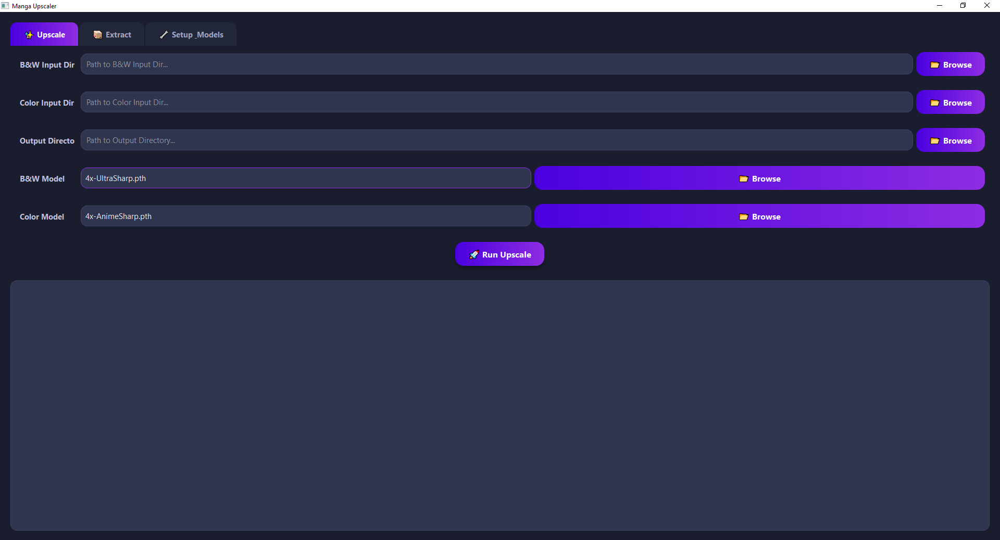

#  Manga Upscaler GUI

A sleek, modern, and powerful GUI for upscaling manga and anime images, built with PyQt6. This project provides a user-friendly interface for the high-quality upscaling models, making it easy to enhance your images without complex command-line operations.

## Features

- **Modern & Sleek UI**: A beautiful, dark-themed interface built with PyQt6, designed for ease of use.
- **Versatile Upscaling**: Supports both black & white and color images.
- **Model Management**: Easily download and manage different model packs for various use cases.
- **Archive Extraction**: Automatically extract images from `.zip` and `.cbz` archives.
- **Dual Interface**: Use the intuitive GUI or the powerful command-line interface (CLI) for automation.
- **Cross-Platform**: Works on Windows, macOS, and Linux.

## GUI Preview



## Installation

1.  **Clone the repository:**
    ```bash
    git clone https://github.com/Yui007/manga_upscaler.git
    cd manga_upscaler
    ```

2.  **Install dependencies:**
    It is highly recommended to use a virtual environment.
    ```bash
    # Create a virtual environment
    python -m venv venv

    # Activate it
    # On Windows:
    venv\Scripts\activate
    # On macOS/Linux:
    source venv/bin/activate

    # Install the required packages
    pip install -r requirements.txt
    ```

3.  **Download Models:**
    Use the GUI to download the models you need. Launch the application and navigate to the **Setup & Models** tab.
    ```bash
    python pyqt_app.py
    ```
    - **Best Models (Both)**: A curated pack for general-purpose upscaling.
    - **B&W Models**: Specialized models for black and white manga.
    - **Color Models**: Optimized models for color illustrations and anime.

## Usage

### GUI Mode

The easiest way to use the upscaler is through the graphical user interface.

1.  **Launch the application:**
    ```bash
    python pyqt_app.py
    ```

2.  **Extract Archives (Optional):**
    - Go to the **Extract** tab.
    - Click "Browse" to select the directory containing your `.zip` or `.cbz` files.
    - Click "Run Extraction". The images will be extracted into subfolders within the same directory.

3.  **Upscale Images:**
    - Go to the **Upscale** tab.
    - Select your input directory for B&W images, Color images, or both.
    - Choose an output directory where the upscaled images will be saved.
    - Select the desired upscaling models from the dropdowns. You can also browse for a custom model file.
    - Click "Run Upscale" and monitor the progress in the log window.

### CLI Mode

For automation and scripting, you can use the `manga_upscale.py` script directly.

#### Download Models

```bash
# Download the 'best of both' model pack
python manga_upscale.py download best

# Download only B&W models
python manga_upscale.py download bw

# Download only Color models
python manga_upscale.py download color
```

#### Extract Archives

```bash
python manga_upscale.py extract --input /path/to/your/archives
# Add --overwrite to re-extract existing archives
```

#### Upscale Images

```bash
# Upscale a folder of B&W images
python manga_upscale.py upscale --bw /path/to/bw_images --output /path/to/results

# Upscale a folder of color images
python manga_upscale.py upscale --color /path/to/color_images --output /path/to/results

# Upscale both at once with specific models
python manga_upscale.py upscale \
    --bw /path/to/bw_images \
    --color /path/to/color_images \
    --output /path/to/results \
    --model-bw "4x_MangaJaNai_1200p_V1_ESRGAN_70k.pth" \
    --model-color "4x_IllustrationJaNai_V2standard_DAT2_27k.safetensors"
```

## Acknowledgements & Contributions

This project would not be possible without the incredible work of the following individuals and teams:

-   **Backend Upscaler Engine**: The core upscaling logic is powered by the **[simple_upscaler](https://github.com/thefirst632student/simple_upscaler)** repository by **[thefirst632student](https://github.com/thefirst632student)**. Their work provides the foundation for the powerful image processing in this tool.
-   **High-Quality Models**: Many of the excellent pre-trained models, especially for manga, are from the **[MangaJaNai](https://github.com/the-database/MangaJaNai)** project by **[the-database](https://github.com/the-database)**.

A huge thank you to them for their significant contributions to the open-source community. Please consider supporting their work.

## License

This project is licensed under the MIT License. Note that the included models and backend components may have their own licenses.
